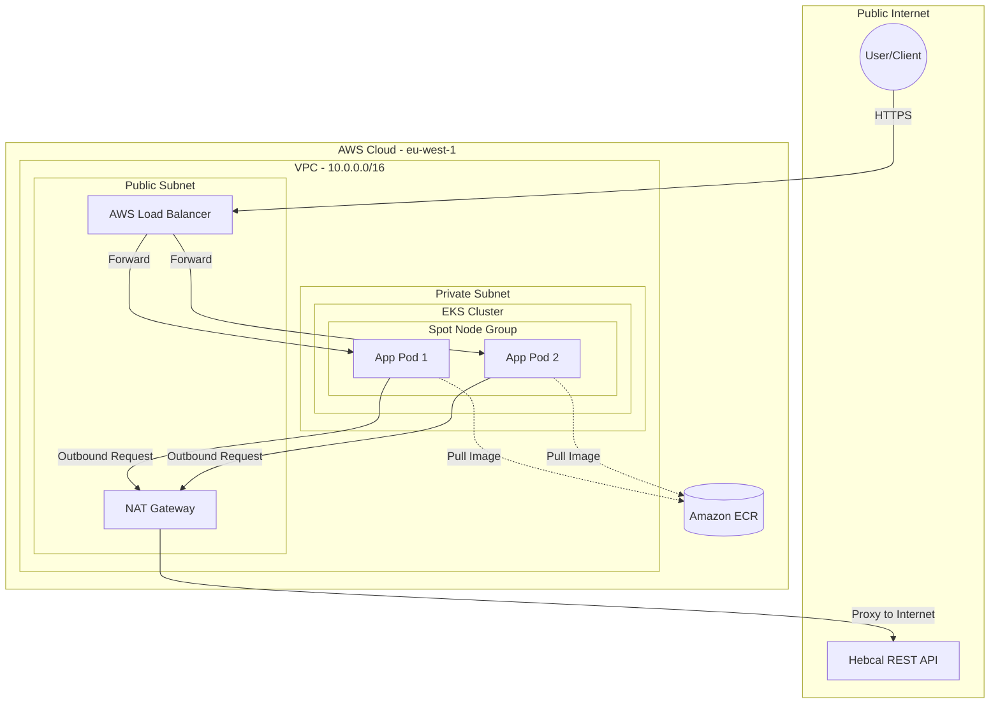

# Jewish Holidays API - EKS Platform

A production-grade, secure, and cost-optimized Kubernetes platform for fetching and displaying Jewish holidays for the upcoming quarter.

## 🚀 Architecture Overview
This project implements a **Well-Architected** infrastructure on AWS using **Pulumi (TypeScript)** and **Python (FastAPI)**.

- **Networking:** 2-tier VPC with Public and Private subnets.
- **Security:** Worker nodes are isolated in Private Subnets; egress traffic is managed via a **NAT Gateway**.
- **Orchestration:** Managed **Amazon EKS** cluster using **AWS Spot Instances** for 70-90% cost savings.
- **Automated Delivery:** Infrastructure-as-Code automatically builds and pushes Docker images to **Amazon ECR** on every deployment.
- **App Stack:** FastAPI microservice with dynamic date calculation and Hebcal API integration.
- **Exposure:** Exposed via an **AWS Load Balancer** providing a centralized entry point for TLS termination.

## 💡 Architectural Trade-offs
In alignment with the **AWS Well-Architected Framework**, several strategic decisions were made to balance reliability, security, and cost:

- **Single NAT Gateway Strategy**: While a production-grade multi-AZ environment typically utilizes one NAT Gateway per Availability Zone, this project implements a **Single NAT Gateway** strategy. 
    - **Benefit**: Reduces infrastructure overhead by approximately **$66/month**.
    - **Trade-off**: In the event of a failure in the specific AZ hosting the NAT Gateway, egress connectivity for the entire cluster would be impacted. This was deemed an acceptable risk for the development/demo phase.
- **Spot Instances for Compute**: Leveraged AWS Spot capacity for worker nodes to achieve up to **90% cost savings** compared to On-Demand pricing, while utilizing EKS Managed Node Groups to handle graceful node termination.

## 🛠️ Project Structure
- `/app`: Python FastAPI application logic and Dockerfile.
- `/infra`: Pulumi TypeScript code for the entire AWS platform.

## ⚙️ Configuration & Secrets
The project uses **Pulumi Config** for environment parameterization and **Pulumi Secrets** for encrypted sensitive data (e.g., API keys).

- `containerImageName`: Parameterized image name.
- `cpuRequest` / `memoryRequest`: Configurable resource limits for Kubernetes pods.
- `app:apiKey`: Encrypted secret injected into pods at runtime.

## ⚡ Quick Start
1. Configure AWS credentials.
2. `cd infra`
3. `pulumi config set --secret app:apiKey "YOUR_KEY"`
4. `pulumi up`
